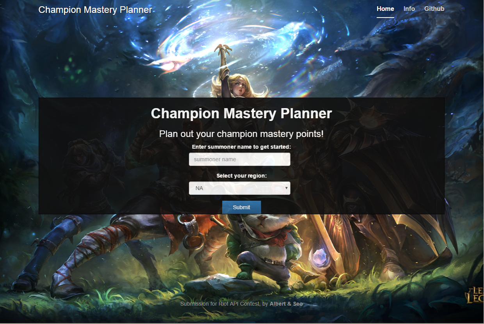
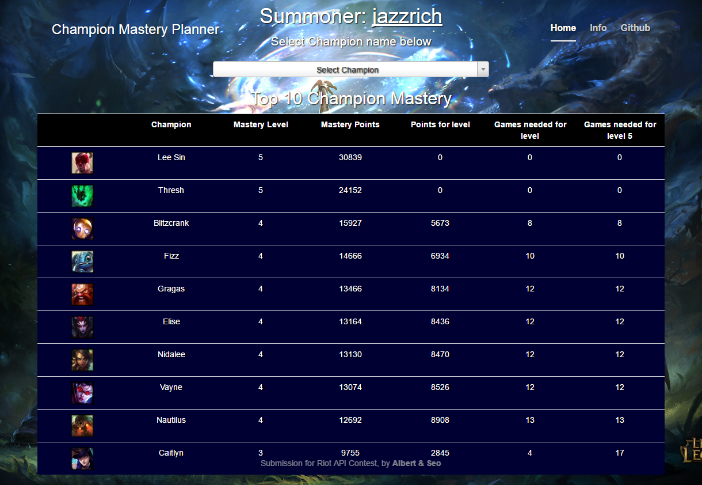
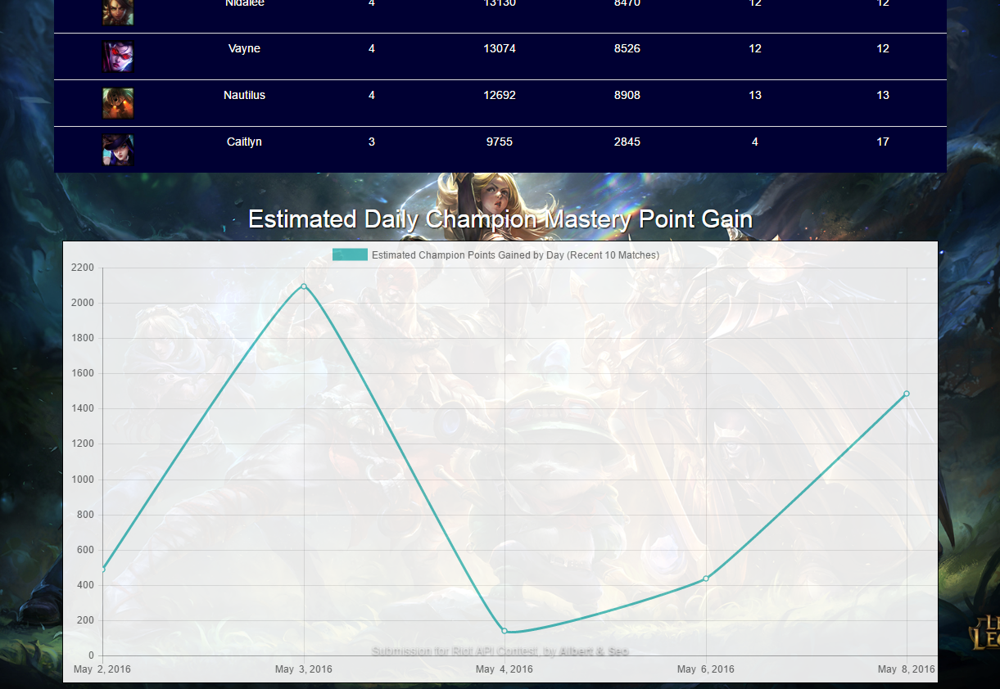
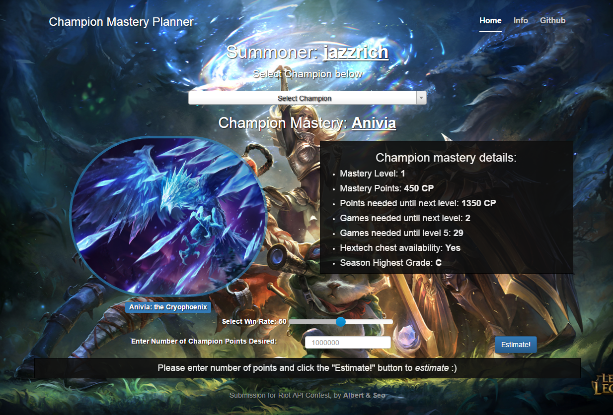
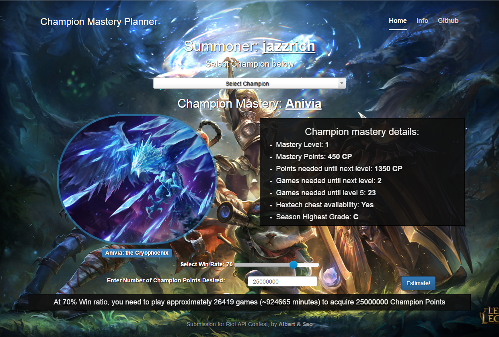

# ChampionMasteryPlanner
A tool for League of Legends users to plan out how many games are needed to obtain the champion mastery they desire

**How to run the development site**  

1. Clone this repo: ```git clone https://github.com/jfseo/ChampionMasteryPlanner.git```
2. Install python (2.7.11)
3. Install the python modules:
  * Django (1.9.6)
  * requests (2.9.1)
4. Copy & paste your Riot API key into the RIOT_API_KEY file
5. Through command prompt, run: ```python manage.py runserver```
6. If no errors, open up a browser (chrome preferred) and navigate to: http://127.0.0.1:8000/


**Python modules** (TODO: probably make a pip freeze)
* Django==1.9.6
* requests==2.9.1

**Our webapp is hosted on heroku: https://lolcmp.herokuapp.com/**

**Please see the [Wiki](https://github.com/jfseo/ChampionMasteryPlanner/wiki/Documentation) on this GitHub repository for documentation.**

# Demo

Demo:
Upon loading the main page https://lolcmp.herokuapp.com/, the user will see:



The user is greeted with a textbook in which they would type in a valid Summoner name. After selecting the appropriate region for the Summoner and hitting the “submit” button, the user is greeted with:



The purpose of this page is to present to the user an easy to understand overview of champion mastery information for the top ten champions of a user-entered Summoner name. The ten champions are listed in order of mastery points for the specified user (decreasing). The first five columns (picture, champion name, mastery level, mastery points, points for level) has relevant champion mastery information and were obtained via Riot API requests. The last two columns (games needed for level and games needed for level 5) were calculated using our models of the true formula for calculating champion mastery point gain for a game (more information of this can be seen in the documentation in the Wiki of the GitHub repository). 
Scrolling down on the same page, the user is greeted with a line chart. 



The purpose of this line chart is to give the user an understanding of the rate at which he or she earns champion mastery points for all champions in his or her recent ten matches. The average Summoner knows that he or she is gaining points every game, but this chart allows them to quantify that information. This chart utilizes the model for estimating champion mastery point gain to calculate total mastery points gained per day. 
Scrolling back up, if the user selects a champion from the dropdown (or, alternatively, clicks on the champion name), he or she is greeted with the champion page:





Here, the user is able to create a plan for the number of games needed to reach their champion mastery goal for the selected champion. The user is shown some basic information about the mastery of the selected champion. He or she is also shown the number of games required to reach the next level and the number of games required to reach level 5 (again, in the way used in the top ten champion page).

The user is also able to freely select a win rate and enter his or her own number of champion points desired.  After he or she clicks on the “Estimate” button, they are shown the number of games/minutes required to reach the user-inputted champion mastery points with the user-inputted winrate.




